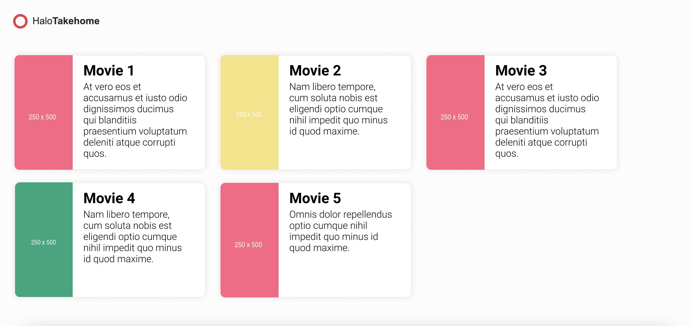

## Halo Takehome

### Description

Halo Takehome is part of the interview process of Halo.
It's a small and fake project for you to show your skills.
By defult the project comes with a simple header and nothing else.

### Running the project

Fork this github repository and make the new repo private.

- Clone your repo
- Install the dependencies running `npm i`.
- Run the backend server with the example movie endpoints running `npm run server`.
- Run the angular application by running `npm run start`.

### Tasks

- Create a card component to show movies. You can use the example image as a reference (there is no need to make it pixel perfect since there are no specs -pixels, sizes, fonts, etc.-, but it would be nice to make it as similar as possible).
- Get data from the server and use it to display movies (GET localhost:3000/movies)
- Nice to have (but not mandatory): Paginate the results using an [infinite scroll](https://en.wiktionary.org/wiki/infinite_scroll) (the server works with the pagination in the following way: GET localhost:3000/movies?_page=2&_limit=10).

#### Example image reference

### Evaluation Criteria

-   You follow best practices.
-   It took you a reasonable amount of time.
-   The commit history shows what you did and it's clear to follow.
-   Completeness: did you complete the features? Is it tested and the tests run?
-   Correctness: does it work as expected?
-   Maintainability: is it written in a clean, maintainable way?

### Code submission

Please organize, test and document the code as it were a real application going to production.
Push your changes to the main branch of your repo and give us access to it.
Keep us updated about it via email.

Good luck and happy coding!.

The ⭕Halo Team
